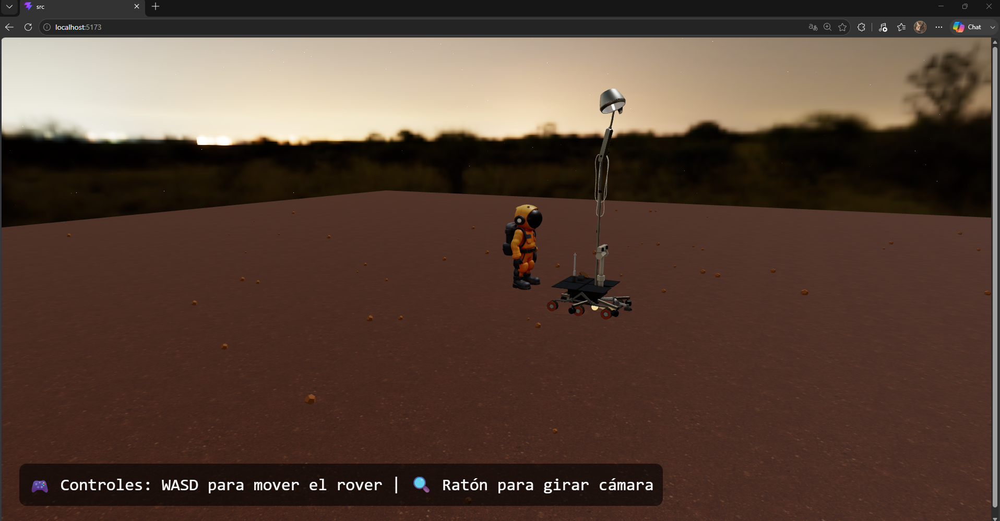
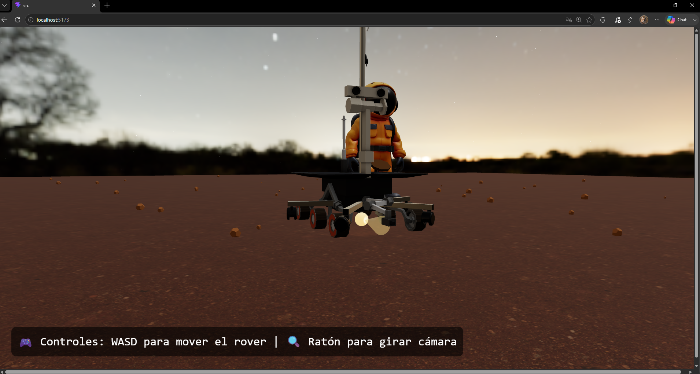

# Examen Final - Computación Visual 2026-I

**Estudiante:** Joan Sebastian Roberto Puerto  


**Repositorio:** https://github.com/zebzs/examen-final-computation-visual-Joan-Roberto  


**Fecha de entrega:** 13/06/2026


## Descripción general

Este repositorio contiene la solución al examen final de Computación Visual. El examen consta de dos ejercicios independientes:

1. **Ejercicio 1 – Procesamiento visual e IA**  
   Aplicación en Python que carga una imagen (`sudoku.png`), aplica un pipeline de procesamiento que incluye: conversión a escala de grises, transformación a espacio HSV, suavizado Gaussiano, detección de bordes Canny, segmentación mediante umbralización y contornos, y guardado de resultados comparativos. Se generan 11 imágenes de salida que documentan el efecto de cada operación.

2. **Ejercicio 2 – Escena 3D interactiva temática**  
   Escena 3D desarrollada con **React Three Fiber** sobre el tema **Exploración espacial** (superficie marciana). Incluye jerarquías de objetos (rover con linterna como hijo, rocas), transformaciones (movimiento con WASD, rotación, escala), materiales PBR (textura de suelo marciano), iluminación coherente (luz solar, ambiente, spotlight en rover), animaciones (flotación y salto del astronauta), interacción entre elementos (astronauta cambia de color, salta y muestra texto al acercarse) e interacción del usuario (teclado para mover el rover, ratón para cámara).

## Dependencias

### Ejercicio 1
- Python 3.10 o superior (probado con Python 3.14)
- OpenCV 4.13.0 (instalable vía pip)
- NumPy 2.4.2

Las versiones exactas se especifican en `ejercicio_1_procesamiento_visual/requirements.txt`.

### Ejercicio 2
- Node.js (v16 o superior)
- npm o yarn
- **React Three Fiber** y **Drei** (incluidos en el proyecto)
- Three.js

## Instalación

### Clonar el repositorio
```bash
git clone https://github.com/zebzs/examen-final-computation-visual-Joan-Roberto.git
cd examen-final-computation-visual-Joan-Roberto
```

### Instalar dependencias del ejercicio 1
```bash
pip install -r ejercicio_1_procesamiento_visual/requirements.txt
```
O si se prefiere instalar directamente:
```bash
pip install opencv-python numpy
```

### Instalar dependencias del ejercicio 2
```bash
cd ejercicio_2_escena_3d_interactiva
npm install
```

## Ejecución

### Ejercicio 1
```bash
cd ejercicio_1_procesamiento_visual/src
python main.py
```
El script procesará la imagen `../data/sudoku.png` y guardará los resultados en `../resultados/`.

### Ejercicio 2
```bash
cd ejercicio_2_escena_3d_interactiva
npm run dev
```
Abrir `http://localhost:5173` en el navegador.  
**Controles:** WASD para mover el rover; ratón para orbitar la cámara (pan, zoom, rotación).

## Estructura del repositorio

```
examen-final-computation-visual-Joan-Roberto/
├── README.md                          # Este archivo
├── .gitignore
├── ejercicio_1_procesamiento_visual/
│   ├── README.md                      # Documentación detallada del ejercicio 1
│   ├── requirements.txt
│   ├── data/
│   │   └── sudoku.png                 # Imagen original
│   ├── src/
│   │   └── main.py                    # Código fuente del pipeline
│   └── resultados/                    # Imágenes generadas (11 archivos)
│       ├── 1_grayscale.jpg
│       ├── 2_hsv.jpg
│       ├── 2_hue.jpg
│       ├── 2_saturation.jpg
│       ├── 2_value.jpg
│       ├── 3_gaussian_blur.jpg
│       ├── 4_canny_edges.jpg
│       ├── 5_threshold_binary.jpg
│       ├── 5b_red_segmentation.jpg
│       ├── 6_contours_detection.jpg
│       └── 7_comparison_mosaic.jpg
└── ejercicio_2_escena_3d_interactiva/
    ├── README.md                      # Documentación detallada del ejercicio 2
    ├── package.json
    ├── public/
    │   ├── models/
    │   │   ├── Rover.glb
    │   │   ├── Astronauta.glb
    │   │   └── linterna1.glb
    │   └── textures/
    │       └── red/
    │           └── red_laterite_soil_stones_diff_4k.jpg
    ├── src/
    │   ├── App.jsx                    # Código completo de la escena 3D
    │   ├── main.jsx
    │   └── index.css
    └── media/                         # Evidencias visuales
        ├── captura_1.png
        ├── captura_2.png
        └── demo.gif
```

## Evidencias

### Ejercicio 1

A continuación se muestran las imágenes más representativas del procesamiento realizado. Para una descripción detallada de cada una, consultar `ejercicio_1_procesamiento_visual/README.md`.

#### Imagen original


#### Mosaico comparativo (Original, Grises, Hue, Suavizado, Bordes, Umbral)


#### Detección de bordes (Canny)


#### Detección de contornos


#### Segmentación por umbral


### Ejercicio 2

#### Vista general de la escena


#### Primer plano del rover con la linterna activada


#### Demostración en movimiento (GIF)
  
*El GIF muestra navegación de cámara, movimiento del rover con WASD, la linterna iluminando el suelo, y la reacción del astronauta al acercarse: salto, cambio de color y texto “🚀 ¡HOLA!”.*

## Análisis técnico

### Ejercicio 1
- **Kernel Gaussiano:** (5,5) con sigma 1.5 – suavizado moderado que preserva bordes.
- **Umbrales Canny:** 50 (inferior) y 150 (superior) – relación 1:3 estándar para capturar bordes débiles y fuertes en la cuadrícula del sudoku.
- **Umbral de binarización:** 127 – punto medio de la escala 0-255, separa números oscuros del fondo claro.
- **Segmentación HSV rojo:** rangos (0-10) y (170-180) – ejemplo de segmentación por color.

### Ejercicio 2
- **Jerarquía:** `group` rover → `group` linterna (con modelo 3D, spotlight, cono visual, halo). Rocas dentro de un `group` padre.
- **Transformaciones:** Traslación (WASD), rotación (hacia la dirección de movimiento), escala (rover 0.8, linterna 0.25, astronauta 8, rocas 0.2–0.7).
- **Cámara interactiva:** `OrbitControls` con pan, zoom y rotación.
- **Materiales PBR:** Suelo con textura difusa, roughness y metalness; modelos GLB con sus propios materiales; linterna con materiales emisivos y transparentes.
- **Iluminación:** AmbientLight, DirectionalLight (simula sol), PointLight (relleno), Spotlight (linterna del rover), Environment nocturno (`preset="night" background={true}`).
- **Animaciones:** Astronauta flota (`Math.sin`) y ejecuta salto parabólico al acercarse el rover; rover se desplaza continuamente.
- **Interacción entre elementos:** Distancia < 3.5 → astronauta cambia a naranja brillante, salta y muestra texto.
- **Interacción del usuario:** Teclado (WASD) para mover el rover; ratón para control de cámara.

## Uso de IA

Durante el desarrollo de ambos ejercicios se emplearon herramientas de inteligencia artificial de forma auxiliar para tareas concretas:

- **Ejercicio 1:** Consulta de rangos HSV para segmentación de rojo, combinación de imágenes con `np.hstack`, manejo de rutas relativas con `os.path.dirname`.
- **Ejercicio 2:** Orientación de cono de luz (linterna), implementación del salto parabólico del astronauta, configuración de cielo envolvente con `Environment preset="night"`.

Todo el código fue revisado, ajustado manualmente y validado visualmente. No se utilizaron modelos preentrenados para segmentación en el ejercicio 1, ni generación automática del pipeline completo.

*Para más detalles, consultar los README específicos de cada ejercicio.*

