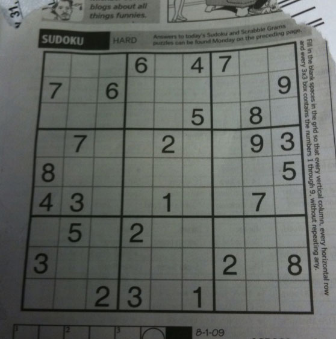
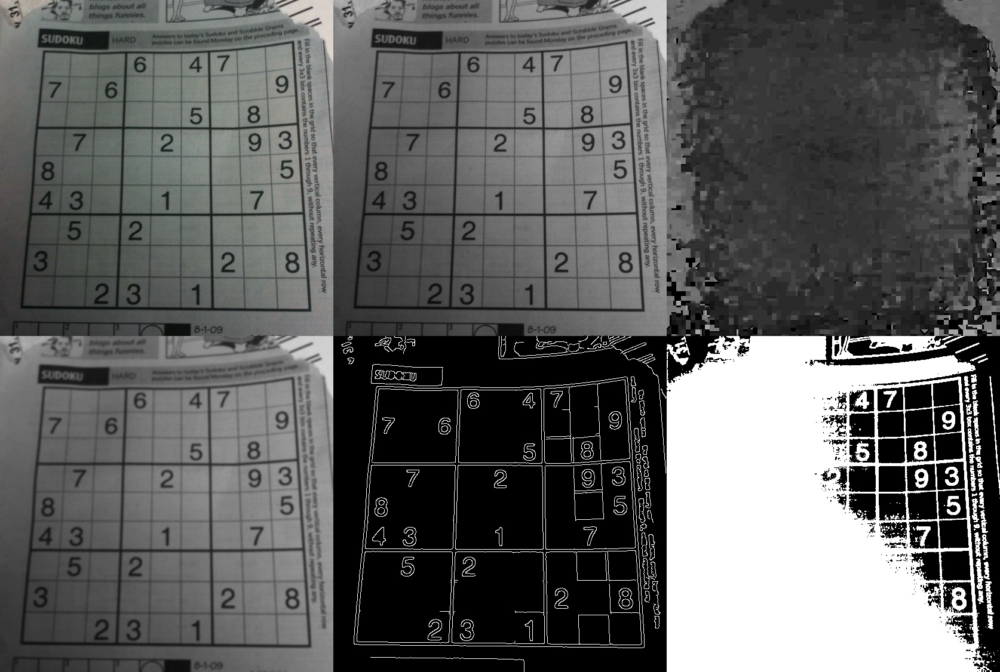
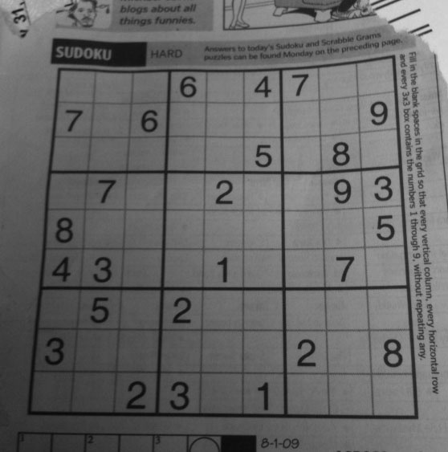
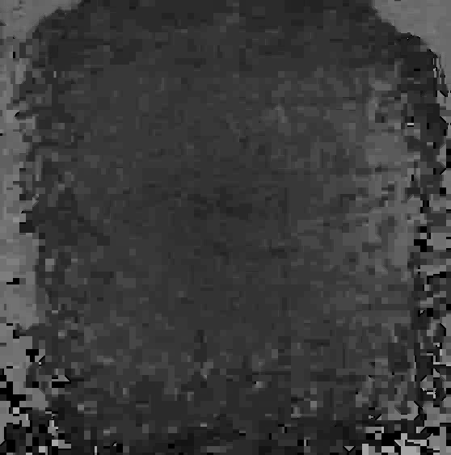
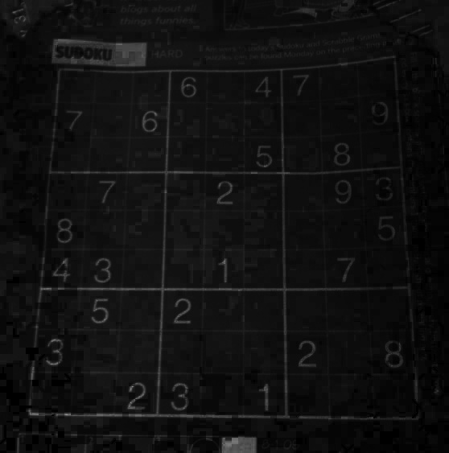
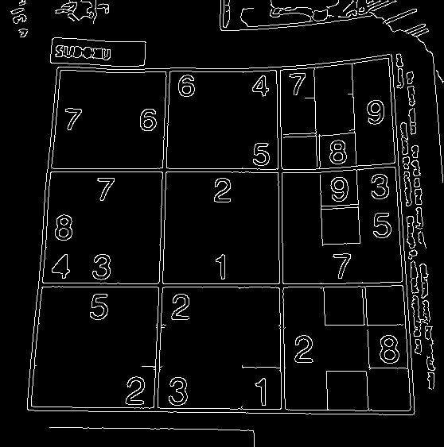
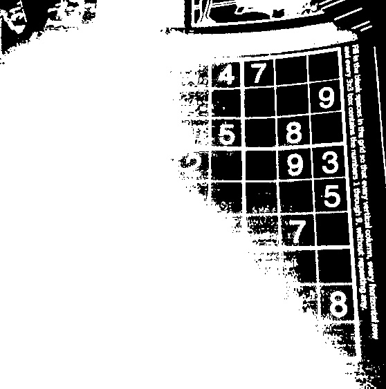
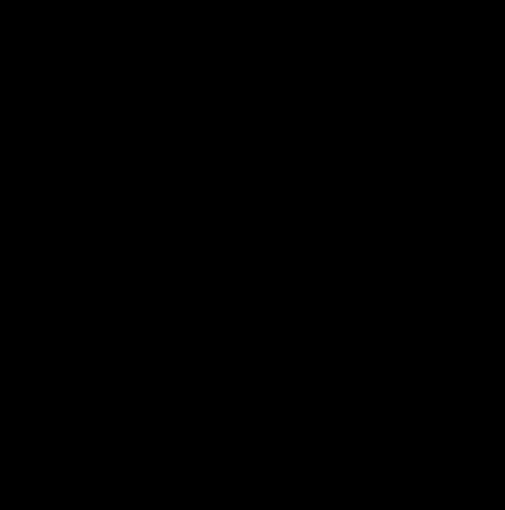
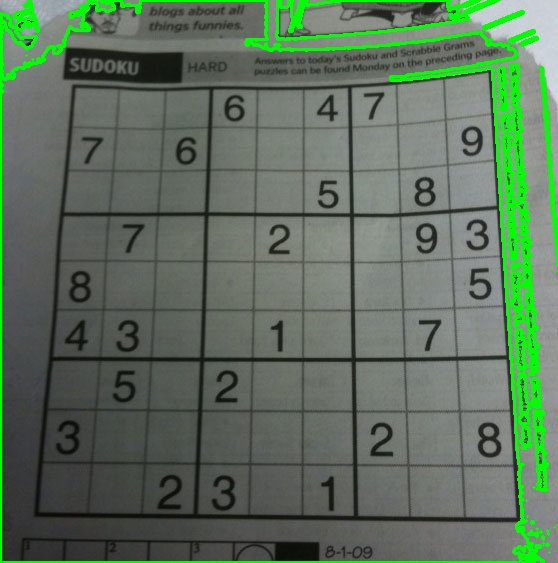

# Ejercicio 1 – Procesamiento visual e IA

## Propósito

Este ejercicio implementa un pipeline completo de procesamiento de imágenes utilizando OpenCV. El objetivo es transformar una imagen de entrada (en este caso, `sudoku.png`) mediante varias operaciones estándar de visión por computador:

- Conversión a escala de grises
- Cambio de espacio de color (RGB → HSV)
- Suavizado (filtro Gaussiano)
- Detección de bordes (Canny)
- Segmentación clásica (umbralización + detección de contornos)
- Segmentación adicional por color (HSV)

Cada resultado se guarda como archivo de imagen para permitir la comparación visual y el análisis de los efectos de cada etapa. El código es reproducible y está documentado.

## Herramientas, librerías y motores

- **Python** 3.14
- **OpenCV** (cv2) 4.13.0 – para todas las operaciones de carga, transformación, filtrado, detección de bordes y segmentación.
- **NumPy** 2.4.2 – para manejo de arreglos y operaciones auxiliares.
- **os** – para manejo de rutas y creación de directorios.

No se utilizaron motores adicionales ni redes neuronales preentrenadas; la segmentación se realizó con técnicas clásicas (umbralización y contornos). Se incluye una segmentación por color en HSV como complemento.

## Imagen original

La imagen utilizada es `sudoku.png`, ubicada en la carpeta `data/`. Es una imagen clásica de prueba que contiene una cuadrícula de sudoku con números bien definidos, ideal para evaluar detección de bordes y segmentación.



## Ejecución de la solución

### Prerrequisitos

- Python 3.10 o superior (compatible con las versiones de las librerías)
- pip instalado

### Instalación de dependencias

Desde la raíz del repositorio:

```bash
pip install -r ejercicio_1_procesamiento_visual/requirements.txt
```

Si se prefiere instalar directamente:

```bash
pip install opencv-python numpy
```

### Ejecutar el script

```bash
cd ejercicio_1_procesamiento_visual/src
python main.py
```

### Parámetros de entrada (modificables)

En `main.py` se pueden cambiar las siguientes líneas:

- `INPUT_IMAGE`: ruta a la imagen (por defecto `../data/sudoku.png`).
- `OUTPUT_DIR`: carpeta donde se guardan los resultados (por defecto `../resultados`).
- Parámetros del filtro Gaussiano: `GAUSSIAN_KERNEL`, `GAUSSIAN_SIGMA`.
- Umbrales de Canny: `CANNY_THRESH1`, `CANNY_THRESH2`.
- Umbral de binarización: `BINARY_THRESH`.

## Resultados obtenidos

El script genera los siguientes archivos dentro de `ejercicio_1_procesamiento_visual/resultados/`. A continuación se muestran las imágenes más representativas.

### Mosaico comparativo (vista rápida)



*Este mosaico agrupa: Original | Grises | Hue | Suavizado Gaussiano | Bordes Canny | Umbralización.*

### Escala de grises



### Espacio de color HSV (canales)

| Canal Hue | Canal Saturación | Canal Valor |
|-----------|------------------|--------------|
|  |  |  |

### Suavizado Gaussiano


### Detección de bordes (Canny)



### Umbralización binaria



### Segmentación de color rojo (ejemplo en HSV)



*Nota: En `sudoku.png` no hay rojo, pero la máscara se muestra como ejemplo de segmentación por color.*

### Detección de contornos



## Parámetros utilizados y justificación técnica

| Parámetro | Valor | Justificación |
|-----------|-------|----------------|
| Kernel Gaussiano | `(5, 5)` | Tamaño impar (5×5) proporciona un suavizado moderado. Un kernel más pequeño (3×3) apenas reduciría el ruido; uno más grande (7×7) desenfocaría los bordes de los números. |
| Sigma Gaussiano | `1.5` | Desviación estándar que equilibra la eliminación de ruido y la preservación de bordes. Valores entre 1 y 2 son típicos para imágenes de este tamaño. |
| Umbral inferior Canny | `50` | Detecta bordes débiles (transiciones suaves). Si fuera más bajo (ej. 30) capturaría demasiado ruido; si fuera más alto (ej. 80) perdería bordes de números poco contrastados. |
| Umbral superior Canny | `150` | Relación 1:3 respecto al inferior. Define qué bordes son fuertes. Un valor menor dejaría bordes más gruesos y ruidosos; uno mayor (200) perdería detalles finos. |
| Umbral de binarización | `127` | Punto medio del rango de 8 bits (0-255). Separa claramente los números (grises oscuros, valores <127) del fondo blanco de la imagen de sudoku. |
| Rangos HSV para rojo | `(0,50,50)-(10,255,255)` y `(170,50,50)-(180,255,255)` | Cubren los dos rangos del rojo en el círculo cromático HSV. Útil para segmentar objetos rojos en caso de existir. En la imagen del sudoku no hay rojo, pero se deja como ejemplo genérico. |

## Dificultades encontradas y cómo se resolvieron

1. **Problema de ruta de imagen**  
   - Al ejecutar `python src/main.py` desde la carpeta `ejercicio_1_procesamiento_visual`, el script no encontraba `sudoku.png`.  
   - **Solución**: Se cambió la estructura para tener la imagen en `data/` y se usó `os.path` para construir rutas absolutas relativas al script.

2. **Error de instalación de dependencias**  
   - `pip install -r requirements.txt` fallaba porque `numpy==1.24.3` no es compatible con Python 3.14 (recién lanzado).  
   - **Solución**: Eliminar las versiones fijas y dejar que pip instale las últimas (`opencv-python` y `numpy` sin versión). Se actualizó el `requirements.txt`.

3. **Advertencia de OpenCV al cargar la imagen**  
   - OpenCV mostraba `WARN: can't open/read file` cuando la ruta no era correcta.  
   - **Solución**: Verificar que el archivo exista en la carpeta de ejecución y que tenga permisos de lectura. Con la ruta absoluta relativa se solucionó.

## Uso de IA

Durante el desarrollo de este ejercicio se utilizaron herramientas de inteligencia artificial de forma auxiliar, principalmente para agilizar la escritura de fragmentos de código repetitivos o para consultar sintaxis específica de OpenCV. 

### Prompts utilizados

1. **Segmentación por color en HSV**  
   *Prompt:* “Dame un ejemplo de segmentación de color rojo usando OpenCV en espacio HSV, con rangos adecuados.”  

2. **Creación de mosaico comparativo**  
   *Prompt:* “Cómo puedo combinar varias imágenes en un mosaico usando OpenCV y NumPy, por ejemplo un grid 2x3.”  

3. **Manejo de rutas relativas**  
   *Prompt:* “En Python, ¿cómo obtener la ruta absoluta de un archivo que está en una carpeta padre respecto al script?”  
   *Uso:* La sugerencia de usar `os.path.dirname(__file__)` y `os.path.join` me ayudó a reorganizar las carpetas `data/` y `resultados/` para que el script sea portable.

### Verificación manual

Todo el código generado con ayuda de IA fue revisado línea por línea, probado con la imagen `sudoku.png` y ajustado en parámetros (tamaño de kernel, umbrales de Canny, etc.) hasta obtener los resultados mostrados en este documento. Ninguna parte del código se dejó sin comprender o sin validar visualmente.

## Verificación manual por el estudiante

Se realizaron las siguientes comprobaciones manuales:

- Se ejecutó el script con la imagen `sudoku.png` y se verificó que se generaran los 11 archivos de salida en la carpeta `resultados`.
- Se abrió cada imagen resultante para inspeccionar visualmente:
  - La escala de grises es correcta y los números son legibles.
  - El filtro Gaussiano suaviza sin eliminar bordes de los números.
  - La detección de bordes Canny resalta las líneas de la cuadrícula y los contornos de los dígitos.
  - La umbralización binaria produce una máscara limpia donde los números aparecen en blanco sobre fondo negro.
  - Los contornos se dibujan correctamente alrededor de los números.
- Se comprobó que el mosaico comparativo (`7_comparison_mosaic.jpg`) contiene las seis imágenes principales en un formato legible.

No se encontraron errores ni comportamientos inesperados. El código es reproducible y cumple con todos los requisitos especificados en el examen.

## Estructura de archivos del ejercicio

```
ejercicio_1_procesamiento_visual/
├── README.md (este archivo)
├── requirements.txt
├── data/
│   └── sudoku.png
├── src/
│   └── main.py
└── resultados/
    ├── 1_grayscale.jpg
    ├── 2_hsv.jpg
    ├── 2_hue.jpg
    ├── 2_saturation.jpg
    ├── 2_value.jpg
    ├── 3_gaussian_blur.jpg
    ├── 4_canny_edges.jpg
    ├── 5_threshold_binary.jpg
    ├── 5b_red_segmentation.jpg
    ├── 6_contours_detection.jpg
    └── 7_comparison_mosaic.jpg
```

## Conclusión

El ejercicio 1 está completamente implementado, documentado y verificado. El pipeline de procesamiento es claro y los resultados son comparables, cumpliendo con el objetivo práctico de la asignatura.
